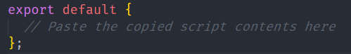

# Delivery Documentation

# Team 0132 -- Application Avengers

# 11/22/2020

## Release Notes

**VERSION**

-   BGCMA Web Application 1.0

**NEW FEATURES**

-   Ability for parents to sign up and login to Web Portal

-   Ability for parents to change their password, if forgotten

-   Ability for parents to create a new application for a child

-   Ability for parents to save application

-   Ability for parents to edit saved application

-   Ability for parents to cancel or submit application

-   Ability for parents to delete incomplete application

-   Ability for admins to sign up and login to Web Portal

-   Ability for admins to verify their email, if forgotten

-   Ability for admins to change their password, if forgotten

-   Ability for admins to view all parents' applications

-   Ability for admins to change status of parents' applications

-   Ability for admins to view any application

**BUG FIXES**

-   Since this is our first release, we have not fixed any previous bugs

**KNOWN BUGS**

-   Web Application slows down on some browsers

-   Refreshing Web Application while updating data might cause
    information to be lost/corrupted

## Install Guide

**PRE-REQUISITES**

-   You must have Node.js and Yarn installed.

    -   Node.js can be installed from: <https://nodejs.org/en/download/>

    -   Node.js comes with a package manager called npm which can be
        used to install Yarn:
        <https://yarnpkg.com/getting-started/install>

**DEPENDENCIES**

-   The files downloaded from the Github repository include a script to
    install any necessary dependencies. There is no need to install any
    third-party software manually besides Node.js and Yarn.

**DOWNLOAD**

-   <https://github.com/samin36/BGCMAWebApplication>

**BUILD**

-   To build the necessary components of the application:

    -   Navigate to the folder containing the downloaded files

    -   If you are in the right folder, you should see a file called
        "package.json"

    -   Open the terminal (CMD/Git Bash on Windows), type in "yarn
        install", and press Enter

    -   If done correctly, yarn will install all the dependencies and
        build the application

**INSTALLATION**

-   Yarn installs the necessary dependencies for Firebase (database) to
    work, but it is still required for the user to link the application
    to their Firebase Project.

    -   Go to <https://console.firebase.google.com/> and login using a
        Google account, if not already.

    -   Click on the + icon as shown below\
        

    -   Enter a project name and click continue

    -   Disable the Google Analytics option for the project and click
        "Create Project". Once the project is created, click continue.

    -   Once on the project homepage, click the angle brackets web icon
        as highlighted below\
        

    -   Give the web app a nickname. If you wish to host the website
        using firebase hosting, check the "Also set up Firebase Hosting"
        option. Click "Register App" after making your choice.

    -   Clicking "Register App" will show
        some scripts needed to link the application with firebase. The
        entire script is not needed, however. Copy the portion shown in
        the image below.\
        

    -   Once copied, open the previously downloaded project files (from
        Github) and navigate to the *Firebase* folder located inside the
        *src* folder.

    -   You should see a Javascript (.js) file called config.js. Open it
        in a text editor, and you will see something similar to the
        image shown below.\
        

    -   Right after the line that begins with //, paste the copied
        script contents. If done correctly, it should look similar to
        the image shown below.\
        

    -   Once this is complete, go back to the firebase console website
        where you copied the script from and click "Continue to
        console".

    -   On the left hand side of the web page, you should see these two
        options:\
        

    -   Click on Cloud Firestore and on the page that loads upon
        clicking, press the "Create Database" button.

    -   A dialog box should popup. If setting up this application for
        product, click the "Start in production mode". Click next and
        then click "Enable" on the screen following it.

    -   Once on the Cloud Firestore page, click the "Rules" tab as shown
        below.\
        

    -   In the editor that pops up upon clicking rules, paste the
        following rules:

    -   Once pasted, click "Publish".

    -   Navigate to the "Authentication" page located on the left hand
        side.\
        

    -   After clicking Authentication, click "Get Started" or "Create
        Authentication" depending on which one shows up.

    -   Once in the Authentication page, navigate to the "Sign-In
        method" tab and click on "Email/Password" which should be the
        first entry in the table that pops up.

    -   After clicking, click on the first
        slider to enable email login. If done correctly, it should look
        similar to the image below.
        

    -   Click "Save"

    -   You are done with the installation!

**RUNNING APPLICATION**

-   Launch a new terminal in the directory containing "package.json".
    This is the same directory from which "yarn install" was done
    earlier. To run the app, type in "yarn start" and press enter. After
    a minute or so, a window in a browser should open with the
    application.

**TROUBLESHOOTING**

-   If you encounter any problems with "yarn install", make sure you
    have yarn installed on your machine using npm.

-   With any other problem, try repeating the entire process again.
